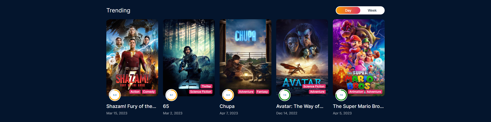

# Movies & TV Shows

Tech-Stack: `React` `Redux` `React-Router` `SCSS` `Axios`

<a href="https://movies-and-shows-git-main-soumyasagnik.vercel.app/">Visit</a>

## Desktop View

### Home Page

filters fetch fresh data

### Details Page

Video Enabled

### Explore Page

Infinite Scroll Enabled

Sort and Filter option enabled

### Search Page

All the items are clickable

## Mobile View

Fully Responsive

